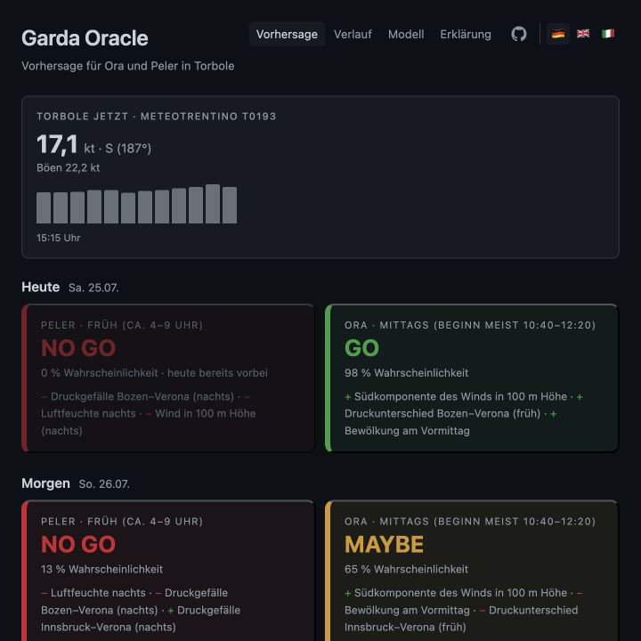
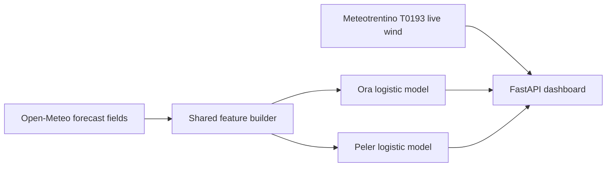

# Garda Oracle

Explainable forecasts for the two characteristic thermal winds at northern
Lake Garda:

- **Peler** — the northerly morning wind, roughly 04:00–09:00;
- **Ora** — the southerly afternoon wind, roughly 12:00–17:00.

[Open the live dashboard](https://garda.simon-stieber.de/) ·
[Read the model card](docs/model-card.md) ·
[Review data licences](DATA_SOURCES.md)



Garda Oracle turns openly reusable weather observations and forecast fields
into separate three-day probabilities for Ora and Peler. It also shows live
wind at Torbole, the strongest factors behind each forecast and a 30-day
comparison with observations. The interface is available in German, English
and Italian.

## Why this exists

Weather models provide pressure, cloud, radiation and wind fields, but they do
not directly answer the question a rider asks: *Will the local lake wind
actually establish itself?*

The project started with a transfer question. An earlier hobby project,
[Walchi Thermic Oracle](https://walchensee.simon-stieber.de/), forecasts the
local thermal at Lake Walchensee. Rather than copy that model, Garda Oracle
reused the methodology: define measurable local outcomes, assemble relevant
large-scale weather signals, validate honestly across years and test whether
skill survives the move from reanalysis to real forecast inputs.

At Garda the answer was unusually clear. Two independent logistic models
substantially outperform a month-of-year climatology:

| Regime | Base rate | Leave-one-year-out Peirce | Climatology Peirce |
|---|---:|---:|---:|
| Ora | 69% | **+0.54** | +0.22 |
| Peler | 53% | **+0.39** | +0.20 |

On 513 days from 2024–2026, features from the previous day's actual forecast
run retained the signal: best-threshold Peirce was +0.59 for Ora and +0.49 for
Peler. These results are described with their limitations in the
[model card](docs/model-card.md).

## How it works



The models are trained offline with scikit-learn. Serving needs none of the ML
stack: coefficients, scaling values, calibration parameters and decision
thresholds are frozen in `src/garda/coeffs.py` and scored with the Python
standard library.

The same pure-Python feature builder is used during coefficient export and
live scoring, which prevents a separate training implementation from silently
drifting away from production.

See [architecture](docs/architecture.md) for the request and training flows.

## Local development

Prerequisite: [uv](https://docs.astral.sh/uv/).

```bash
git clone https://github.com/s1st/garda-oracle.git
cd garda-oracle
uv sync --frozen --extra dev
uv run uvicorn garda.web:app --reload --port 8765
```

Open <http://127.0.0.1:8765/>. No credentials are needed. The local dashboard
uses the public Open-Meteo and Meteotrentino endpoints.

Quality checks:

```bash
uv run --frozen pytest -q
uv run --frozen ruff check src tests scripts
uv run --frozen mypy src
```

## Reproducing the model

Raw observations and forecast downloads are not committed. They are
recreated using public endpoints:

```bash
uv sync --frozen --extra dev --extra ml
uv run python scripts/fetch_torbole.py --end-date 2026-07-03
uv run python scripts/build_labels.py --end-date 2026-07-03
uv run python scripts/fetch_era5_garda.py --end-date 2026-07-03
uv run python scripts/fetch_prevruns_garda.py --end-date 2026-07-03
uv run python scripts/export_garda_coeffs.py
```

The dates above reproduce the training snapshot used by the committed model.
Providers may correct historical records later, so a future download is not
guaranteed to be byte-identical. The committed coefficient golden-vector test
protects the served model from accidental changes.

See [reproducibility](docs/reproducibility.md) for the full workflow, expected
files and validation commands.

## Repository layout

```text
src/garda/
├── features.py       # forecast retrieval and shared feature construction
├── model.py          # pure-Python logistic scoring and explanations
├── coeffs.py         # generated model artefact
├── history.py        # 30-day day-ahead hindcast versus observations
├── i18n.py           # German, English and Italian copy
├── web.py            # FastAPI application and caches
└── templates/        # Jinja2 dashboard pages
scripts/              # public-data download, research and model export
tests/                # scorer, feature, history, i18n and web tests
```

## Deployment

The included Dockerfile builds the same application used by the public site.
It does not contain credentials. `GARDA_GATE_SECRET` can optionally protect a
raw Cloud Run origin when a reverse proxy injects the corresponding
`X-Gate-Secret` header. `CF_BEACON_TOKEN` optionally enables cookieless
Cloudflare Web Analytics. The maintained deployment also accepts the exact
custom host `garda.s1st.de` without the proxy header so its INWX-managed DNS
can reach Google's custom-domain frontend directly.

The checked-in `cloudbuild.yaml` contains the maintainer's current GCP resource
names as non-secret deployment configuration. Forks should replace the image,
service and region substitutions with their own resources.

## Data, licence and limitations

Copyright © 2026 Simon Stieber. Project-authored code, documentation and frozen
model parameters are available under the
[GNU Affero General Public License v3.0 only](LICENSE). Weather data remain
subject to their source licences; see [DATA_SOURCES.md](DATA_SOURCES.md) for
exact attribution and distribution boundaries.

This is a decision aid for wind sports, not an official weather warning or
safety service. Local wind can differ materially from a single station or
grid-cell forecast. Check current observations, official warnings and
conditions on site.

Contributions are welcome; start with [CONTRIBUTING.md](CONTRIBUTING.md).
