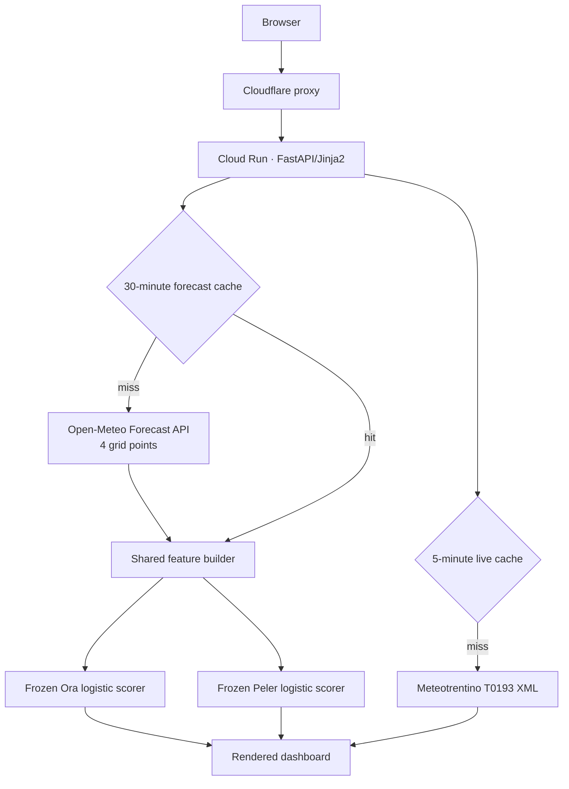
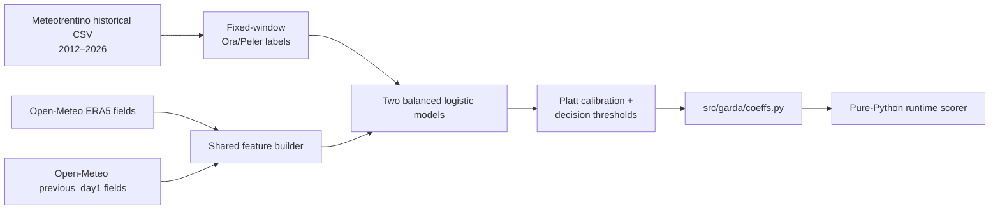

# Architecture

Garda Oracle deliberately separates offline model development from the small
runtime application. The deployed dashboard contains no scikit-learn, pandas
or NumPy.

## Live request flow

The four forecast points are Torbole, Verona, Bolzano and Innsbruck. Torbole
supplies the local cloud, solar, humidity, precipitation, temperature and
100-metre wind fields. The other points provide pressure and temperature
contrasts across the Alps and Po Valley.

`GARDA_GATE_SECRET` is optional origin protection. When set, the application
returns 404 unless the reverse proxy supplies a matching `X-Gate-Secret`
header. It is not a visitor login and is disabled in local development. The
exact pseudonymous custom host `garda.s1st.de` is the deliberate exception:
it reaches the same service through Google's custom-domain frontend without
the Cloudflare header. On that host, rendered identity links and canonical
metadata remain on the pseudonymous `s1st.de` face.

## History flow

The `/verlauf` page is a hindcast, not a database of every page response:

1. Meteotrentino historical wind speed and direction are fetched for the last
   30 full days.
2. Open-Meteo Previous Runs provides `previous_day1` fields representing what
   the previous day's model run predicted.
3. The same production feature builder and frozen models score those fields.
4. Model verdicts are shown next to the observed Ora/Peler labels.

The result is cached in-process for six hours. It measures a stable day-ahead
question, but it is not an audit log of the precise forecast displayed to
visitors at different times.

## Offline training flow

ERA5 supplies the long training sample. Previous-run forecast fields supply
the probability calibration and decision thresholds so the live forecast is
scored on the distribution it will actually see.

## Components

| Component | Responsibility |
|---|---|
| `src/garda/features.py` | Fetch live fields and build identical feature windows at training and serving time |
| `src/garda/model.py` | Standardise inputs, calculate logits/probabilities and rank feature contributions |
| `src/garda/coeffs.py` | Generated model parameters; no executable training dependency |
| `src/garda/history.py` | Construct the 30-day day-ahead hindcast and observed labels |
| `src/garda/web.py` | Routes, language selection, origin protection and in-process caches |
| `scripts/` | Fetch public data, validate model skill and export coefficients |

## Deployment

The production shape is one stateless Cloud Run service. There is no database
and no scheduled forecast job: the first request after the 30-minute TTL
refreshes forecast fields. This keeps operations simple, but means the project
does not yet persist every forecast version shown to users.
